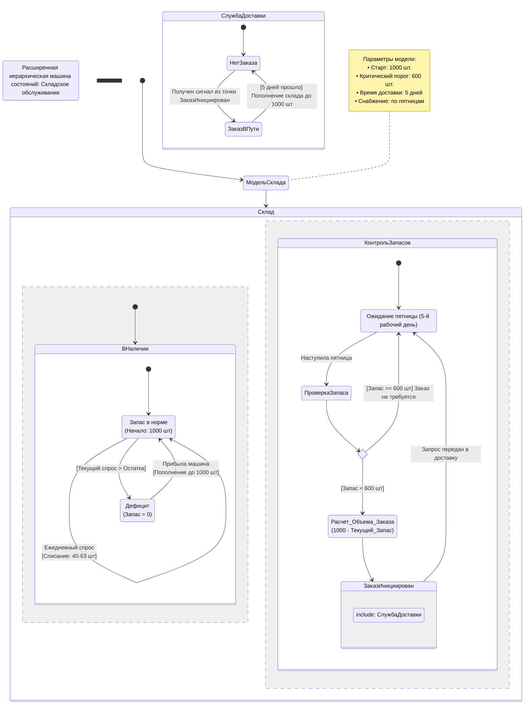

```mermaid
%%{
  init: {
    'theme': 'neo',
    'themeVariables': {
      'look': 'neo'
    },
  }
}%%

stateDiagram-v2

title: Расширенная иерархическая машина состояний: Складское обслуживание

state "Складское обслуживание (Модель)" as МодельСклада <<fork>>
[*] --> МодельСклада

%% --- БЛОК СТАНДАРТНОЙ РАБОТЫ СКЛАДА И ИНВЕНТАРИЗАЦИИ ---
state Склад {
    direction TB
    
    state ВНаличии {
        direction TB
        [*] --> Запас_ОК
        
        state "Запас в норме<br>(Начало: 1000 шт)" as Запас_ОК
        state "Дефицит<br>(Запас = 0)" as Дефицит
        
        %% Логика изменения внутренностей склада
        Запас_ОК --> Запас_ОК: Ежедневный спрос<br>[Списание: 40-63 шт]
        Запас_ОК --> Дефицит: [Текущий спрос > Остатка]
        
        Дефицит --> Запас_ОК: Прибыла машина<br>[Пополнение до 1000 шт]
    }

    [*] --> ВНаличии
    
    --
    
    state КонтрольЗапасов {
        direction TB
        [*] --> ОжиданиеПятницы
        ОжиданиеПятницы: Ожидание пятницы (5-й рабочий день)
        
        ОжиданиеПятницы --> ПроверкаЗапаса: Наступила пятница
        
        state ПроверкаЗапаса: Проведение инвентаризации
        state ЗапасНизкий <<choice>>
        
        %% Переход из инвентаризации в ромб условия
        ПроверкаЗапаса --> ЗапасНизкий
        
        %% Стрелки ветвления идут строго после ромба условия
        ЗапасНизкий --> ОжиданиеПятницы: [Запас >= 600 шт] Заказ не требуется
        
        %% Переход в отдельную ячейку расчета при нехватке запаса
        ЗапасНизкий --> РасчетОбъема: [Запас < 600 шт]
        
        state "Расчет_Объема_Заказа<br>(1000 - Текущий_Запас)" as РасчетОбъема
        
        %% Из ячейки расчета переходим к инициации заказа
        РасчетОбъема --> ЗаказИнициирован
        
        state ЗаказИнициирован {
            state "include: СлужбаДоставки" as инклюд_доставки
        }
        ЗаказИнициирован --> ОжиданиеПятницы: Запрос передан в доставку
    }
}

%% --- БЛОК СЛУЖБЫ ДОСТАВКИ ПОСТАВЩИКА ---
state СлужбаДоставки {
    direction TB
    
    state НетЗаказа: Ожидание нового заказа
    state ЗаказВПути: В пути (Доставка 5 рабочих дней)
    
    [*] --> НетЗаказа
    НетЗаказа --> ЗаказВПути: Получен сигнал из точки ЗаказИнициирован
    ЗаказВПути --> НетЗаказа: [5 дней прошло] Пополнение склада до 1000 шт
}

МодельСклада --> Склад

note left of МодельСклада
  Параметры модели:
  • Старт: 1000 шт.
  • Критический порог: 600 шт.
  • Время доставки: 5 дней
  • Снабжение: по пятницам
end note
```